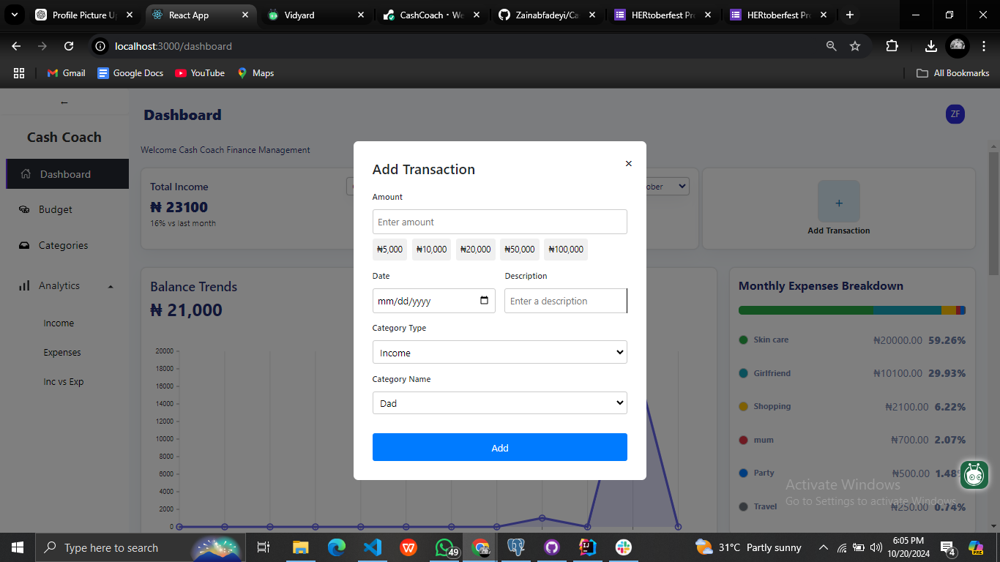
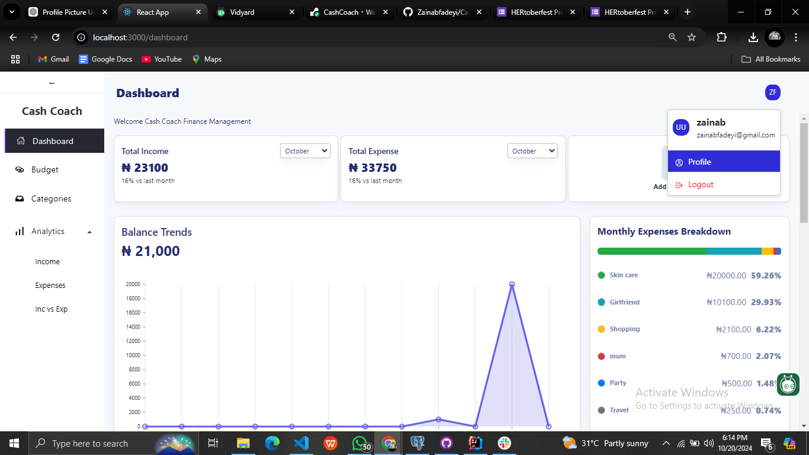

# Cash Coach

**Cash Coach** is a comprehensive web application built to help users manage their personal finances by tracking income, expenses, and budgets. This application allows users to add, categorize, and monitor financial transactions, set budgets, and visualize their income and spending trends over time.

The backend of the project is powered by Django REST Framework, while the frontend is built using React. The application offers a seamless user experience with interactive charts, dynamic data fetching, and user-friendly financial management features.

## Features

1. **Transaction Management**: Add, edit, and delete income and expense transactions.
2. **Category-based Organization**: Transactions are grouped by customizable categories.
3. **Budget Management**:
   - Set budgets for specific categories, and dynamically update the amount spent based on relevant transactions.
   - Real-time progress bar showing the amount spent vs. the total budget for each category.
4. **Income and Expense Tracking**: View daily, weekly, and monthly income/expense trends.
5. **Visual Representation**: Graphs and charts to visualize income and expenses over time.

## Technologies Used

### Backend:
- **Django**: Backend logic, models, and APIs.
- **Django REST Framework (DRF)**: To create robust APIs for interacting with the frontend.
- **PostgreSQL**: For persistent data storage.

### Frontend:
- **React**: User interface with dynamic data handling.
- **Axios**: HTTP requests and integration with the backend API.
- **Chart.js**: For displaying financial trends in an interactive graphical format.

## Project Structure

### Backend (Django):
1. **API for Transactions**: Handles adding, updating, and retrieving income and expense transactions.
2. **API for Budget Management**: Manages budget creation, updates, and real-time tracking of budget progress based on transactions.
3. **Income & Expense Analytics**: Generates insights such as income trends and expense breakdowns.

### Frontend (React):
1. **Transaction Form**: Allows users to input income and expenses with dynamic category selection.
2. **Budget Manager**: Users can view and manage their budgets with real-time progress bars.
3. **Charts**: Visualize income trends and expense breakdowns with interactive charts for easier data analysis.
4. **Navigation**: A clear and intuitive navigation system allowing users to move between income, expenses, budgets, and analytics.

## Installation

### Prerequisites

- Python 3.x
- Node.js and npm
- Django
- React

### Backend Setup (Django)

1. Clone the repository:
   ```bash
   git clone https://github.com/yourusername/CashCoach.git
   cd cash-coach

Backend Setup (Django)

1.  Clone the repository:git clone https://github.com/yourusername/CashCoach.git

cd finance-personal-manager
2.  Create and activate a virtual environment:python -m venv env
source env/bin/activate  # For Windows: env\Scripts\activate
3. Install the required dependencies: pip install -r requirements.txt
4. Setup PostgreSQL :psql -U postgres
5.  Run the migrations: python manage.py migrate
6. Start the Django development server: python manage.py runserver

### Frontend Setup (React)

Now, you should be able to access the app at http://localhost:3000 (React frontend) and the API at http://localhost:8000 (Django backend).

## API Documentation

The **Cash Coach** API provides several endpoints for interacting with the application:

### Authentication
- **POST** `/api/auth/login/`: Login with email and password.
- **POST** `/api/auth/register/`: Register a new user.

### Transactions
- **GET** `/api/transactions/`: Retrieve all transactions.
- **POST** `/api/transactions/`: Add a new transaction.
- **PUT** `/api/transactions/<id>/`: Update an existing transaction.
- **DELETE** `/api/transactions/<id>/`: Delete a transaction.

### Budgets
- **GET** `/api/budgets/`: Retrieve all budgets.
- **POST** `/api/budgets/`: Create a new budget.
- **GET** `/api/budgets/<id>/progress/`: Get progress for a specific budget.


## Navigating the Application

### 1. Home/Dashboard:
Upon login, users are directed to the dashboard, where they can see an overview of their finances (e.g., income, expenses, and budgets).


### 2. Categories:
For you to be able to create a transaction, there must be a category. Navigate to the category page to manage categories.

In the **Categories** section, users can manage the available categories for transactions. Adding new categories allows you to organize your finances more effectively and ensure that transactions are properly categorized. These categories will dynamically appear when users add a transaction in either the income or expense section.


### 3. Transactions:
Go back to the **Dashboard** page. Navigate to the **Add Transactions** modal to add income or expense entries. Dynamic category options are presented based on whether you're adding an income or expense transaction.



### 4. Budgets:
In the **Budgets** section, users can create and manage budgets on a specific category filtered by expense. For you to be able to create a budget, it must be linked to a category you've created.

The budget progress bar will automatically update as transactions are added that match the category of the budget.


### 5. Analytics:
The **Analytics** section provides visual insights into income and expenses, with charts showing daily income trends and monthly expense breakdowns by category. You can also download and export the data in an XLSX spreadsheet with paginated transactions.


### 6. Profile:
Users can manage their personal settings, including updating account information or logging out.




---

## Future Improvements
- **Mobile Optimization:** Make the frontend fully responsive for mobile devices.
- **Notifications:** Add notifications when a budget limit is about to be exceeded.
- **Recurring Transactions:** Add support for recurring income or expense entries.

---

## Contributing
We welcome contributions to enhance the Finance Personal Manager! To contribute:

1. Fork the repository.
2. Create a new branch: `git checkout -b feature-branch-name`.
3. Make your changes.
4. Push to the branch: `git push origin feature-branch-name`.
5. Open a pull request.
